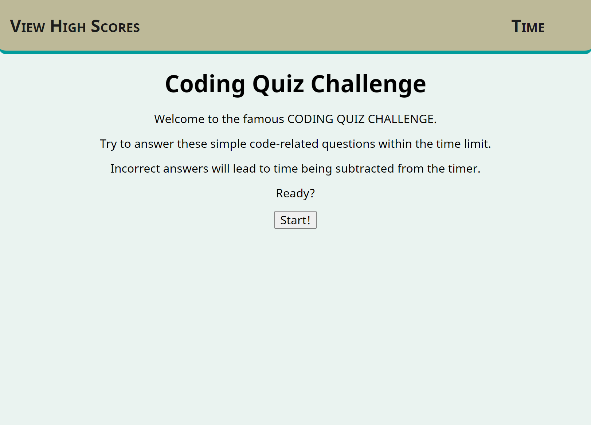
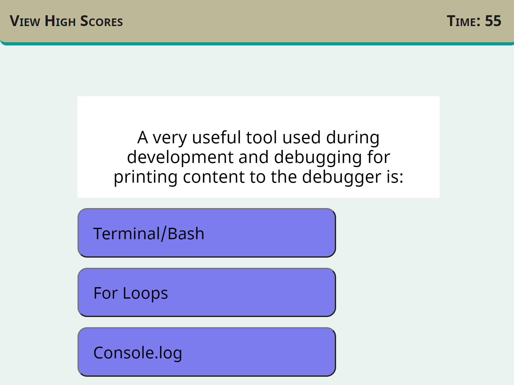

# Coding Quiz Challenge

**You can access the finished project here:
<https://mi544.github.io/coding-quiz-challenge/>**

---

# Unit 04 Web APIs: Code Quiz

<!-- THIS IS IT -->

### The task

Build a timed code quiz with multiple-choice questions.

* App runs in the browser
* Features dynamically updated HTML and CSS powered by JavaScript code
* Has a clean and polished interface
* Is responsive, adapting to multiple screen sizes

### Requirements

* After clicking on the "Start" button, a timer starts, and a question is presented
* After answering a question another question is presented
* After an incorrect answer, time is subtracted from the timer
* When all questions are answered, the game is over
* When timer reaches 0, the game is over
* After the game is over, it's possible to save initials and score

